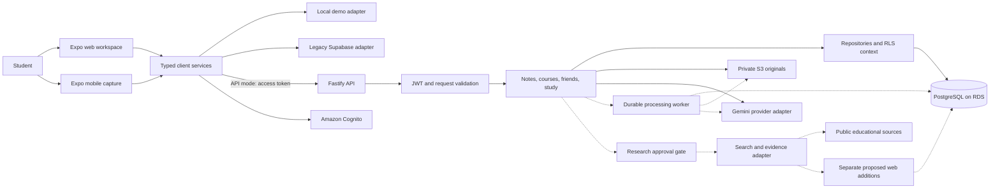
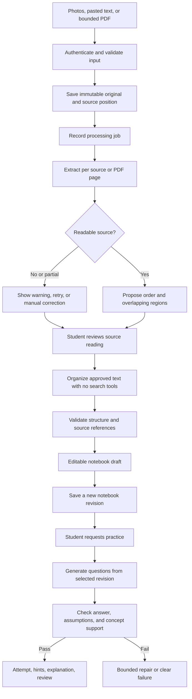
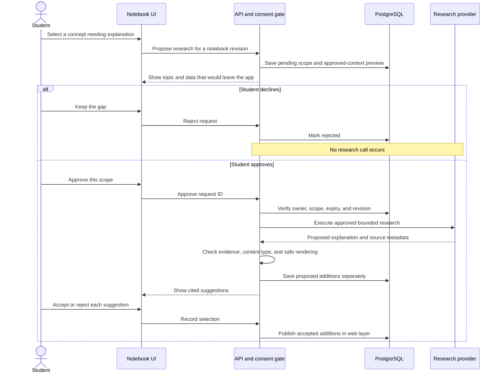
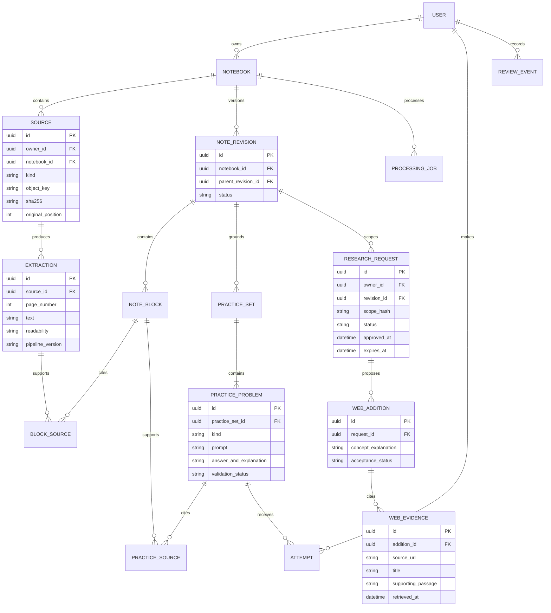
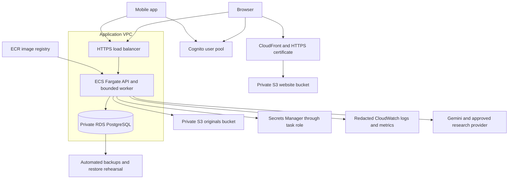

# Chalkwise architecture

Chalkwise was previously named ClassLens. This document describes the **target architecture** for a 10–20 student pilot and distinguishes it from the implemented baseline. The [project roadmap](docs/PROJECT_PLAN.md) defines delivery order, tests, and commit checkpoints. The [product workflow](docs/architecture/PRODUCT_WORKFLOW_PLAN.md) defines the user experience.

## Product and boundaries

Students upload whiteboard photos, loose notes, and eventually PDFs or pasted text. The website organizes them into editable, source-linked notebooks and generates new practice problems from the notes. Mobile remains useful for capture. A student may approve research on a specific concept; accepted web explanations remain visibly separate from class material.

The application is a **modular monolith**: one TypeScript API, one PostgreSQL database, and private object storage. Keep the existing Expo application and service adapters. Target AWS with PostgreSQL on Amazon RDS, Cognito for identity, and S3 for originals. No microservices, Redis, vector database, or autonomous agent framework is required for this pilot.

## Technology inventory

“Existing” means present in the repository, not deployed or verified in AWS. Lockfiles specify exact package versions. Proposed packages must be checked for compatibility and added only in the milestone that uses them.

| Area | Technology | Status and responsibility |
| --- | --- | --- |
| Website and mobile | Expo SDK 57, Expo Router, React 19.2, React Native 0.86, React Native Web 0.21, TypeScript 6 | Existing; retain shared screens/services, add desktop upload/editor layouts |
| Capture and files | `expo-camera`, image picker/manipulator, file system, `jpeg-js` | Existing photo capture, file handling, and quality checks |
| File selection | Browser file/drop APIs and `expo-document-picker` | Browser drop flow planned; document picker is installed but ingestion is not wired |
| PDF processing | PDF.js (`pdfjs-dist`) | Proposed for bounded page preview/text extraction; scanned pages need a separately tested rendering/extraction path |
| Notebook editing | Typed note blocks with plain-text/Markdown editing and revision history | Planned; start with controlled editors and no arbitrary HTML. A large rich-text framework is not required initially |
| Mathematics | KaTeX for web equation display | Proposed, isolated behind a presentation component; disable trusted commands and restrict resource expansion. Native fallback must remain readable |
| API/runtime | Node.js 22.18+, Fastify 5, TypeScript 6 | Existing; authenticated HTTP routes and bounded requests |
| Validation/auth verification | Zod 4, `jose` 6, Fastify CORS/rate-limit plugins | Existing; validate untrusted input and Cognito access tokens |
| Database | PostgreSQL 17 baseline, `pg` 8, reviewed SQL migrations, RLS | Existing schema/driver; RDS provisioning pending. Use a supported patched 17.x release in the chosen region |
| Identity | Amazon Cognito, Expo SecureStore | Client/server integrations exist; pool provisioning and live acceptance pending. Native refresh tokens in SecureStore, browser sessions in memory |
| Original files | Private Amazon S3, AWS SDK v3, presigned read URLs | Existing adapter; bucket/IAM provisioning pending |
| AI | Gemini API through the server's provider interface | Existing extraction, organization, Q&A and quiz calls. Model ID is configurable; versions and prompts require evaluation |
| Research | Search provider behind a dedicated server adapter; Gemini search grounding is a candidate | Planned; availability of tools depends on recorded approval, never on model instructions |
| Reliable processing | PostgreSQL job/stage records and a bounded TypeScript worker | Planned; same API deployment initially. Durable leases, retries and stage results; no external queue service initially |
| Search within notes | PostgreSQL full-text search | Planned when persisted note blocks exist; keyword/topic search before embeddings |
| Unit/API tests | Node built-in test runner, Fastify injection, real signed test JWTs | Existing; test observable behavior and error paths |
| Browser/component tests | Playwright; React Native Testing Library for interaction-heavy shared UI | Proposed; add with the corresponding UI milestone, retaining physical-device acceptance |
| Database tests | Disposable PostgreSQL 17 with the restricted runtime role | Test and CI job exist; run successfully before cloud cutover |
| Formatting/build gates | TypeScript, Prettier, Expo web export, GitHub Actions | Existing; CI execution still requires pushing/running the workflow |
| API deployment | Docker, Amazon ECR, ECS Fargate, HTTPS Application Load Balancer | Dockerfile exists; AWS topology is planned |
| Infrastructure definitions | AWS CDK v2 with TypeScript | Planned for the deployment milestone; synthesize and review changes before any cloud mutation |
| Website hosting | Separate private S3 web bucket, CloudFront, ACM certificate; Route 53 if hosting DNS in AWS | Planned; originals are never served from the public website distribution |
| Operations | CloudWatch, Secrets Manager, IAM task roles, RDS backups, AWS Budgets | Planned provisioning; keep secrets and student content out of logs |
| Optional later hardware | Authenticated, student-paired photo capture client | Deferred; reuse the upload contract only after a concrete device need is demonstrated |

Expo SQLite may support a later on-device pending-upload journal. `expo-background-task` is the permitted background API if that milestone needs it; a background task must not be advertised as guaranteed execution after app termination. Neither Redis nor a new backend language is necessary.

## System diagram

Solid paths below describe existing application responsibilities. Dotted paths are planned extensions or infrastructure. Cloud services are deployment targets; the diagram does not assert they have been provisioned.

Screens call services; services select mock, API, or legacy adapters. Client code never receives database credentials, Gemini credentials, or an AWS secret key. Live code preserves legacy/demo behavior until replacement acceptance. The search path is separate from ordinary analysis and practice generation.

## Processing and practice flow

The current implementation transcribes one to six photos separately, then organizes their transcripts. It retains input order and filters some assignment/exam claims lexically. Persisted extraction blocks, sequencing, revision editing, arbitrary input ingestion, and durable jobs below are target features.

Originals and previous revisions are retained. Overlap detection proposes a merged view without deleting a re-shot board or losing its new lines. Students can override ordering. A failed source remains visible. Transcription failures and organization failures are distinct; successful extraction must remain available when organization fails.

Practice is **generated from notes**, as selected by the user. Start by extending the existing quiz service with persistent practice sets, source references, attempts, and explanations. Add free-response/numeric questions only with defined validation and feedback limits. Generated examples may use new numbers; validate their derivation from the taught concept rather than requiring their numbers to appear in the notes. Never display them as assignments from the lecturer.

## Research consent and separate evidence

The research adapter must provide the actual supporting passage or retrievable page evidence as well as a URL. A URL alone does not establish support. If a provider returns citations without usable supporting evidence, surface the limitation and do not label the result verified. A restricted fetcher must reject private/local addresses and unsafe redirects, bound response size/time, strip active content, and treat all page text as untrusted input.

Class notes are checked against class sources. Web additions are checked against retrieved web evidence. They remain separately stored, collapsible, removable, and labeled. The research output contract permits concept explanations and worked examples only. It cannot create assignments, deadlines, exam dates, or a reconstruction of an unreadable board. Search approval does not automatically approve adding results to the notebook.

Consent is an owner-bound, revision-bound, expiring server record. The normal model routes have no search tools. Prompt injection cannot grant approval. Repeated client requests reuse an operation ID; revoked/stale requests cannot publish late results. Already-sent requests cannot be unsent, so cancellation blocks retries/publication and attempts to abort in-flight work where supported. New scope requires new approval.

## Target data model

Existing tables are `profiles`, `courses`, `course_memberships`, `friendships`, `lectures`, `materials`, and `reviews` in the application schema. The following ER diagram is a **logical extension**, not applied DDL. Retain existing lecture routes while introducing course-optional notebooks through reviewed additive migrations and compatibility mapping. SQL changes need owner-scoped RLS and integration tests.

Implementation must carry owner identity through every new record or an unambiguous parent relation. Use database constraints for same-owner references; UUID knowledge alone never grants access. Source/page locations and text spans belong in reference records. Model/prompt versions and generation settings belong with produced artifacts. Every accepted revision is immutable; edits create another revision using optimistic concurrency. An outdated editor must receive a conflict, not silently overwrite newer work.

Class-only practice initially cites note blocks. If practice later uses accepted web additions, add explicit `practice_web_evidence` references and disclose the expanded source scope; never relabel web-derived content as class-only. Review events can target a notebook or practice item through an explicit constrained relationship defined in that migration. Exact key types and SQL are settled during migration review.

## API and module boundaries

| Module | Owns | Contract direction |
| --- | --- | --- |
| Identity/access | Cognito verification, request identity, ownership | Existing `/v1` authentication boundary |
| Materials | Upload intents, originals, signed URLs, input bounds | Extend photo API with separately validated text/PDF paths |
| Notes | Extraction, ordering, notebook revisions and source links | New revision endpoints; retain existing lecture services |
| Processing | Job states, leases, stage outcomes and retries | Pollable job status; no long-lived client request required |
| Practice | Set generation, validated problems, attempts and hints | Extend quiz capability; generation and attempt writes use stable operation IDs |
| Research | Pending requests, approval, evidence and proposed additions | Separate propose/approve/results/accept/reject operations |
| Social/review | Explicit sharing, independent copies and review schedule | Preserve existing behavior while adding new record coverage |

Suggested route families are `/v1/notebooks`, `/v1/notebooks/:id/revisions`, `/v1/jobs/:id`, `/v1/practice-sets`, `/v1/problems/:id/attempts`, and `/v1/research-requests`. These are design targets, not currently supported endpoints. Final request/response types must be agreed in `SHARED_CONTRACTS.md` before implementation. Validation errors and provider failures keep safe codes and correlation IDs.

## Jobs, retries, and storage consistency

Current retry keys survive only the client process. The target worker claims a job in a short transaction, records a lease, releases database locks, and performs provider work outside the transaction. Stage results and publication use stable IDs and unique constraints. Lease expiry permits recovery after a crash; bounded retry/backoff handles transient failures. At-least-once processing is expected, so publication must be idempotent. Limit concurrency, total provider calls, input pages, tokens, elapsed time, and per-user usage.

The runtime role cannot scan every user's private content through RLS. Use a narrow dispatcher capability to claim an opaque job ID and its verified persisted owner; execute content access in a transaction scoped to that owner. Review and test this boundary separately. Do not solve scheduling by granting the API or worker BYPASSRLS.

Database and S3 writes are not one transaction. Keep the existing pending/ready upload protocol and immutable objects. Save files before publishing references; record interrupted intents for recovery. Cleanup of abandoned objects is a separate bounded operator procedure. Account deletion/export must cover originals, derived text, revisions, attempts, and research evidence with an explicit retention policy; it must not silently break independently owned shared copies.

## AWS deployment target

Start in one region with one API task and five database pool connections. Choose instance sizes, egress paths, and backup retention against a measured pilot budget. Use private RDS access restricted to the application and approved migration path; verify RDS TLS with the CA bundle. Use a distinct migration principal. Application migrations never run automatically at startup. Match connection/load-balancer limits to the final job model. In-process rate limits need shared coordination only if adding replicas.

Infrastructure-as-code is planned with [AWS CDK in TypeScript](https://docs.aws.amazon.com/cdk/v2/guide/home.html) at the deployment milestone: networking, database, buckets, identity, task roles, logs, alarms, HTTPS, and budget configuration. Serve the web export through a [CloudFront S3 origin](https://docs.aws.amazon.com/AmazonCloudFront/latest/DeveloperGuide/DownloadDistS3AndCustomOrigins.html) with restricted bucket access. Review the generated change set before deployment. Developer/CI AWS access should use scoped short-lived identity; no permanent cloud keys in Git. Cloud provisioning, paid resources, migrations, and production cutover require a separate explicit deployment request.

The [deployment runbook](docs/architecture/AWS_DEPLOYMENT.md) covers Cognito policy, runtime roles, RDS TLS, S3 privacy, migration and rollback. Keep the legacy Supabase adapter until live parity and a rehearsed cutover. After new writes, rollback requires reconciliation rather than only changing a client environment variable.

## Quality gates

- **Every code checkpoint:** app/server TypeScript, relevant unit/API tests, formatter, and `git diff --check`; web export for UI changes.
- **Persistence:** real PostgreSQL RLS tests using a non-owner login, two/three-user sharing tests, duplicate request tests, optimistic-concurrency conflicts, and crash recovery.
- **Learning:** reproducible source-linked fixtures, answer-key checks, unsupported-question abstention, human review of representative math and diagram examples, and unchanged original notes after practice generation.
- **Research:** no search before approval; stale/foreign/revoked approval rejection; injection tests; real evidence for citations; assignment/date/board-reconstruction prohibition; accept/reject/removal and late-result tests.
- **UI:** browser upload/editor/practice flows, keyboard operation, labels/contrast/large text, and physical-device camera/SecureStore verification.
- **Release:** dependency review, CI run, container build, backups/restore rehearsal, provider latency/cost measurements, and documented unresolved limits.

The current lexical support filter is a heuristic. It has reproduced negation and cross-assignment deadline failures; transcript-only organization and green unit tests do not establish semantic correctness. Run the evaluation milestone before releasing web enrichment, and extend it to generated practice.

## References

- [Expo SDK 57 compatibility and APIs](https://docs.expo.dev/versions/v57.0.0/)
- [Amazon RDS PostgreSQL releases](https://docs.aws.amazon.com/AmazonRDS/latest/PostgreSQLReleaseNotes/postgresql-versions.html)
- [Gemini search grounding](https://ai.google.dev/gemini-api/docs/google-search)
- [PDF.js project](https://mozilla.github.io/pdf.js/)
- [KaTeX options](https://katex.org/docs/options.html)
- [Project roadmap](docs/PROJECT_PLAN.md), [shared contracts](SHARED_CONTRACTS.md), [historical verification](docs/architecture/VERIFICATION.md)
