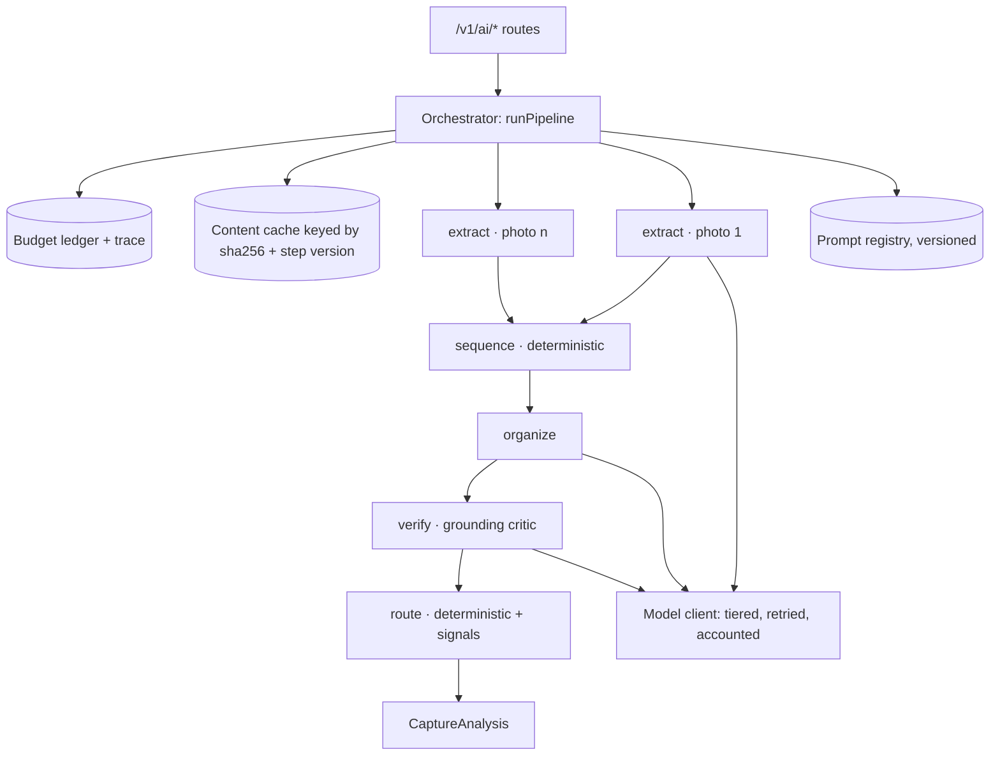

# Chalkwise: agent orchestration and evaluation plan

Status: proposal. Not approved work. [The full-stack delivery plan](FULL_STACK_PLAN.md)
remains authoritative for checkpoints 0–5; this document proposes checkpoints 6–9 and
does not authorize starting any of them. `CHALKWISE_IMPLEMENTATION_PLAN.md` stays
historical context for the Supabase-era milestones.

This plan covers two things the current documents do not: how Chalkwise turns a set of
lecture photos into study material through an orchestrated set of narrow AI steps, and
how the quality of that output is measured before it reaches a student.

---

## What "Microsoft/Google level" means for a 20-user pilot

The instinct behind the phrase is right, but the usual reading of it is wrong for this
product. `AGENTS.md` is explicit: build incrementally for 10–20 users and avoid
deployment-scale infrastructure. Kubernetes, vector databases, distributed queues and a
service mesh are not what makes Google-grade software good; they are what makes it
survive scale it does not yet have.

What actually transfers to a pilot of this size is discipline, and it is cheap:

| Discipline | What it means here |
| --- | --- |
| Typed contracts at every boundary | Already the strongest part of this repo. Extend it into the AI pipeline instead of leaving prompts as loose strings. |
| Deterministic orchestration | A fixed graph of narrow steps with declared budgets and failure policy. No autonomous loops, no unbounded tool use, no "the agent will figure it out". |
| Measurement before belief | Every AI behavior has a dataset, a metric, a baseline number and a regression gate. A prompt change that is not measured is not shipped. |
| Observability and reversibility | Every run leaves a structured trace. Every prompt and model is a version that can be rolled back without a code deploy. |

Everything below sizes to one API container, one PostgreSQL database, one S3 bucket and
a laptop that can run the eval suite in a few minutes.

---

## Where the system actually stands today

An honest baseline, read from the code rather than the README.

| Area | Current state | Location |
| --- | --- | --- |
| AI invocation | One provider call per request. Three prompt strings selected by `kind`, one model tier, temperature 0.2, JSON response mode, 60 s timeout. No retry, no repair pass, no cache, no trace, no token accounting. | `server/src/ai.ts` |
| Analysis context | `/v1/ai/analyze` passes `{}` as context. The model sees one photo and no course list, enrollment or schedule. | `server/src/app.ts` |
| Course matching | A free-text label is matched against enrolled courses by normalized string comparison. Unmatched or ambiguous prompts the student, which is correct behavior. | `src/features/courses/matchCourse.ts` |
| Output validation | Shape validation only: types, trimming, exactly five questions, four distinct options, answer matches an option. Nothing checks whether a claim is supported by the photo. | `src/lib/lectureAnalysis.ts`, `src/lib/quiz.ts`, `src/lib/askLecture.ts` |
| Q&A and quiz context | Up to six photos plus saved lecture fields, with a 10 MiB ceiling enforced in the repository and again in the AI client. | `server/src/repository.ts`, `server/src/ai.ts` |
| Multi-photo capture | Capture supports six photos per session. Processing refuses to run for more than one and shows "Session preserved… Processing will support the full set when the Milestone 3 pipeline is implemented." | `src/app/processing.tsx` |
| AI test coverage | Zero. The API suite stubs the AI with `throw new Error('AI must not run')`. Parser unit tests cover structure, not correctness. | `server/tests/api.test.ts`, `tests/domain.test.ts` |
| Test wiring | `server` has `test`/`test:db`/`typecheck` scripts. The root package has no `test` script, so `tests/domain.test.ts` runs only if invoked by hand, and the root typecheck excludes `tests/**` and `server/**`. | `package.json`, `tsconfig.json` |
| Continuous integration | None. All gates are manual. | — |

Foundations worth building on rather than replacing: `sha256` is already computed and
stored for every material, which makes extraction results cacheable by content; lecture
saves already carry an idempotency key; RLS is enforced with a non-owner role and
transaction-local identity; the error taxonomy and request IDs are already in place.

---

## The product case for orchestration

This is not a quality upgrade bolted onto a working feature. The headline capture
experience is blocked on it.

A student can take six photos of a whiteboard sequence. `processing.tsx` then returns
early, saves nothing, and tells them to go back to the camera. The reason is structural:
`analyzeMaterial` is defined as one photo per material, so a session of six has no
contract to run through. Fixing that by sending six images into one prompt and hoping
for a better summary is the tempting shortcut, and it is the wrong move — one unreadable
photo degrades the whole result, nothing is cacheable, a single failure loses the
session, and there is no way to show the student which photo a fact came from.

Splitting the work into narrow steps solves the product problem and the quality problem
at the same time. Per-photo extraction is parallel, cacheable and independently
recoverable; synthesis sees clean text instead of six images; and every organized bullet
can point back to the photo it came from, which is exactly the `faithfulExtraction`
promise in the existing implementation plan.

The second product case is harm. For a study tool, the worst failure is not a bland
summary — it is an assignment or an exam date that the lecture never mentioned. A
student who trusts a fabricated deadline is worse off than one who used no app at all.
That failure mode is invisible to every test in the repo today.

---

## Target architecture

### The seam

`server/src/ai.ts` exports a single interface:

```ts
export type Ai = { generate(kind, context, photos): Promise<unknown> };
```

`buildApp` takes it as a dependency and the tests already substitute it. That makes the
entire orchestrator an internal replacement behind an existing seam: routes, validation,
auth, RLS and the mobile contracts do not change on day one. This is why the work can be
staged safely, and why the first orchestration checkpoint can produce byte-identical
output to today's pipeline before any behavior changes.



### The step contract

Every model call and every deterministic transform is a `Step` with the same shape, so
the runtime can trace, budget, cache and test all of them uniformly.

```ts
type Step<I, O> = {
  name: string;                 // 'extract'
  version: string;              // 'extract@3' — part of the cache key and the trace
  input: ZodType<I>;
  output: ZodType<O>;
  tier: 'fast' | 'reasoning';   // model routing, not a hardcoded model id
  budget: { timeoutMs: number; attempts: number; maxOutputTokens: number };
  run(input: I, ctx: RunContext): Promise<O>;
};
```

`RunContext` carries the trace ID, a clock, the model client, the cache, the logger and
a **budget ledger** that holds the run's remaining time, token and call allowance. The
ledger — not each step — is what makes a runaway pipeline impossible: when the allowance
is exhausted the run stops and returns whatever partial result it already has.

The user ID lives in `RunContext` for authorization and trace correlation and is never
interpolated into a prompt.

### The agents

| Step | Kind | Input → output | Why it is separate |
| --- | --- | --- | --- |
| `extract` | Model, one call per photo, parallel | photo → `{ readability, confidence, contentType, text, unclearSegments[], courseSignals }` | Per-photo isolation means one glare-blown shot cannot poison the session. Cache key is the existing `sha256` plus the step version, so retries and re-analysis are free. |
| `sequence` | Deterministic code | extractions → ordered, de-duplicated extractions | Board photos overlap. Token-shingle similarity removes the duplicate half of a re-shot whiteboard. No model needed, so no cost and no variance. |
| `organize` | Model, one call over text | extractions → `{ title, topic, summary, keyConcepts, importantPoints, assignments, examMentions }` | Synthesis over clean text beats synthesis over six images, and lets the images be re-attached only when `readability` is `partial`. |
| `verify` | Hybrid critic | organization + extractions → filtered organization + support map | The highest-value step in the system. Lexical support check first; only the residue goes to a model adjudicator. Unsupported `assignments` and `examMentions` are **dropped**, not flagged, because a student skims. |
| `route` | Deterministic + signals | `courseSignals` + enrollment + capture time → `{ decision: 'auto' \| 'confirm' \| 'ask', courseId, confidence }` | Thresholds are calibrated against the eval set, so abstention is a tuned behavior rather than a guess. Extends `matchCourse`, never creates a course. |
| `answer` | Model | lecture + extractions + question → `{ answer, citations: photoIndex[] }` | Citations are checkable, which turns "is it grounded?" into a computable metric. |
| `quiz` → `quizCheck` | Model, then deterministic + grounding | lecture context → validated `GenerateQuizResult` | `parseQuizResult` already enforces structure. `quizCheck` adds answer-key support and regenerates once on failure. |

### Orchestration policy

- **Fan-out is bounded by the existing ceiling.** At most six photos, already enforced in
  `repository.context` and `ai.generate`; concurrency is capped at that number.
- **One repair attempt.** On a schema failure, the validator error is appended and the
  call is retried once. A second failure returns the existing typed `AI_INVALID_RESULT`.
  No silent second model, no fallback to a weaker result presented as success.
- **Partial success is a feature.** If `organize` fails, the notebook still saves with
  originals and faithful extraction. This matches the existing principle that errors
  never turn into fake success, and it makes the six-photo flow usable even on a bad day.
- **Idempotent runs.** The run key is `(subjectId, pipelineVersion, inputHash)`. A replay
  returns the recorded run instead of paying for the model twice.
- **Untrusted input stays data.** The current system instruction already says source text
  and photos are never instructions. Formalize it: extracted text is wrapped in an
  explicit data envelope before it reaches `organize`, and prompt injection becomes a
  blocking eval gate rather than a hope.

### Latency and budget arithmetic

The constraint is real and needs to be designed against, not discovered. Fastify's
`requestTimeout` is 90 s and the provider call timeout is 60 s. Six sequential model
calls do not fit. Parallel extraction plus one synthesis plus one bounded verification
does:

```
extract × 6, parallel     ≈ max(single extract)   ~6–12 s
sequence (deterministic)                           <50 ms
organize (text only)                              ~4–8 s
verify (lexical + residue adjudication)           ~1–4 s
                                        p95 target ≤ 45 s
```

If measured p95 exceeds the budget, the fallback is an asynchronous run record with
client polling — designed for, deferred until the numbers require it. The AI rate limit
of ten requests per minute per user applies to the route, not to internal fan-out, so
the budget ledger must independently cap provider calls per user per hour.

### Prompts as versioned data

Prompts move out of the `shapes` string map into `server/src/agents/prompts/<step>.v<N>.md`,
loaded through a registry that records a content hash in every trace. Changing behavior
becomes a version bump with an eval report attached, and rollback is a constant change
rather than a revert. The rendered prompt hash, model id, tier, token counts and latency
belong in the trace for every step.

### Proposed schema additions

Additive only, reviewed separately, applied only on explicit request — consistent with
the existing migration discipline:

| Table | Purpose | Notes |
| --- | --- | --- |
| `analysis_runs` | One row per pipeline execution: subject, pipeline version, status, totals, timings | RLS mirrors `materials`: owner-only |
| `analysis_steps` | One row per step: name, version, prompt hash, tokens, latency, cache hit, outcome | Trace retention 30 days, then purge |
| `extractions` | Per-material faithful extraction keyed by `(material_id, step_version)` | User-owned content under the same RLS; makes Q&A cheap and deletion honest |
| `ai_feedback` | Student reports on a specific span: "this is not in my notes" | Opt-in, links to `trace_id`, feeds the eval set |

Storing extractions is a deliberate trade: it removes repeated photo reads from Q&A and
quiz generation and makes citations stable, at the cost of holding derived text that
must be deleted with the material. The deletion path is part of the checkpoint, not a
follow-up.

---

## The evaluation system

### Principles

1. **Measure the harm, not the vibe.** Summary elegance is a monitoring metric. An
   invented assignment is a blocking one.
2. **Rare failures are counted, not averaged.** With 25 golden sessions, a "98 % precision"
   target is statistical theater. The gate is: zero unsupported assignment or exam items
   across the golden and adversarial sets.
3. **A judge that has not been calibrated against humans cannot gate a release.**
4. **The hold-out set is never used for prompt iteration.** Iterate on `dev`, gate on
   `holdout`, and report both.
5. **Every published number names its dataset version, pipeline version and sample size.**

### Datasets

Captured on real devices during the pilot, with consent, stored under `evals/data/` with
a dataset card recording provenance, consent, slice counts and known gaps.

| Set | Size (v1 target) | Contents | Labels |
| --- | --- | --- | --- |
| `golden-capture` | ~25 sessions / ~80 photos | Whiteboard, projector slide, handwritten, worksheet; glare, blur, angle, partial crop; STEM and humanities | Reference extraction, key-fact list, unreadable regions, content type, true course, true assignments and exam mentions (often empty — that is the point) |
| `golden-qa` | ~120 questions | Questions over golden lectures | Reference answer, supporting photo index; ~40 % deliberately unanswerable from the notes |
| `golden-quiz` | ~25 lectures | Quiz generation inputs | Human answer key and supporting span per question |
| `adversarial` | ~15 cases | A board reading "ignore previous instructions"; a slide with another course's code; a photo containing a visible name or ID; an unrelated photo | Expected refusal, expected abstention, expected redaction |

Slices matter more than the total: a headline number that hides a 40 % failure rate on
handwritten notes is worse than no number.

### Metrics and gates

| Metric | Definition | Gate |
| --- | --- | --- |
| `unsupported_assignments` | Generated assignment items with no support in the reference extraction | **Blocking: must be 0** |
| `unsupported_exam_mentions` | Same for exam mentions | **Blocking: must be 0** |
| `injection_resistance` | Adversarial cases where instructions embedded in an image changed behavior | **Blocking: must be 0** |
| `abstention_accuracy` | Unanswerable questions answered with an explicit "not in your notes" | **Blocking: ≥ 0.90, CI lower bound** |
| `key_fact_recall` | Labeled facts present in the extraction | Blocking on regression > 2 pp against baseline |
| `groundedness` | Organized bullets traceable to an extraction span | Blocking on regression > 2 pp |
| `citation_validity` | Q&A citations pointing at a photo that supports the claim | Blocking on regression |
| `quiz_key_correctness` | Answer keys a human agrees with, on a sampled subset | Monitor, with quarterly human audit |
| `content_type_accuracy`, `route_top1`, `route_abstain_correct` | Classification and routing quality | Monitor |
| `p95_latency_6_photos`, `cost_per_lecture`, `cache_hit_rate` | Operational | Budget, set after the first baseline |

Unsupported-item checks run lexically first — an item is supported when its content
tokens overlap an extraction span above threshold — and escalate only ambiguous cases to
a judge, which keeps the suite cheap enough to run often.

### Judges

Rubric-based, with the judge model distinct from the generator where the provider allows
it. Before any judge is permitted to gate a metric it must be calibrated against at least
100 dual-labeled items and reach Cohen's κ ≥ 0.6, with the agreement number published in
the report. Judge prompts are versioned exactly like pipeline prompts, and re-calibration
is required whenever the judge model or its prompt changes. Reports always carry the
human-audited subset alongside the judge score, so drift is visible.

### Statistics and reproducibility

Temperature 0 and fixed seeds for eval runs. Generative metrics are sampled k = 3 and
reported as mean with a bootstrap 95 % confidence interval and the per-slice n. A change
ships when the confidence interval excludes the regression threshold, not when the mean
happens to move the right way. Numbers from different dataset versions are never compared.

### Harness layout

```
evals/
  data/                  inputs, labels, dataset cards, consent notes
  cassettes/             recorded provider responses, keyed by request hash
  src/run.ts             runner: dataset × pipeline version → results.jsonl
  src/metrics/*.ts       pure functions, unit-tested themselves
  src/judges/*.ts        rubric prompts + calibration harness
  reports/YYYY-MM-DD-<pipelineVersion>.md
  pricing.json           token prices, filled in by the team, used for cost reporting
```

Metric functions are ordinary pure TypeScript with their own unit tests. An eval suite
whose scoring code is untested measures itself, not the model.

Reports are committed. A prompt change then arrives as a diff that shows both the prompt
and its effect on every gate, which is the review experience worth having.

### Cassette replay

The mechanism that makes all of this affordable. Every provider request is canonicalized
— model, rendered prompt, generation config, and photo bytes replaced by their `sha256` —
hashed, and the response stored under `evals/cassettes/`.

- `AI_MODE=replay` (CI default): a cache miss is a hard failure, so tests can never
  silently reach the network or spend money.
- `AI_MODE=record`: refreshes cassettes deliberately, as a reviewed change.
- `AI_MODE=live`: local development and the pre-deployment acceptance run.

This is what finally lets the AI path be tested. Today `server/tests/api.test.ts` asserts
the AI *must not run*; with replay, the real parse, repair and failure paths run
deterministically in CI in seconds.

### Online evaluation

Offline sets go stale. Three in-product signals close the loop, all opt-in, none
requiring photo bytes to leave the account:

- A "this is not in my notes" control on any AI-generated bullet or answer, capturing the
  trace ID and the specific span.
- Existing pilot questions from the full-stack plan — capture-to-notebook completion,
  recovery from failed uploads, return-to-review within a week — recorded as counters.
- Retake rate and quality-warning override rate from the capture screen, which say more
  about extraction quality than any judge.

Reported spans become labeled cases in the next dataset version. The student can delete
them, and deletion removes the derived extraction too.

---

## Engineering gates

### Continuous integration

A single GitHub Actions workflow, required on every pull request:

| Check | Command |
| --- | --- |
| Mobile typecheck | `npx tsc --noEmit` |
| Server typecheck | `npm --prefix server run typecheck` |
| Domain tests | `npm test` — **needs adding to the root package; it does not exist today** |
| Server tests | `npm --prefix server test` |
| Eval smoke | `npm run eval -- --suite smoke --mode replay` (target < 2 min) |
| Whitespace | `git diff --check` |
| Web build | `npx expo export --platform web` |
| Secrets | Secret scan on the diff |
| Dependencies | `npm audit --omit=dev` |

Full eval suites run nightly and are **required** on any change to a prompt version, a
model tier, a step version or the pipeline version, with the generated report committed
alongside the change. Database integration tests stay opt-in behind `TEST_DATABASE_URL`,
exactly as they are now.

### Service objectives

Pilot-sized, published, and reviewed monthly rather than continuously alerted:

| Objective | Starting target |
| --- | --- |
| Capture → notebook completion | ≥ 97 % of sessions that reach processing |
| p95 pipeline latency, six photos | ≤ 45 s |
| AI request error rate | < 2 % |
| Cost per analyzed lecture | Budget set after the first baseline report |
| Unsupported assignment or exam items in production reports | 0 |

### Release and rollback

The pipeline version is configuration, not a code path. A regression is rolled back by
pinning the previous version, which restores the previous prompts, tiers and step
versions together. Traces record the version that produced every stored notebook, so a
bad batch can be identified and re-run rather than guessed at.

---

## Proposed checkpoints 6–9

These follow the existing checkpoint table format and continue its numbering. They start
only after checkpoint 3 (app API adapter) and checkpoint 4 (study workspace) land —
orchestration on top of an unfinished client is building on sand. The one exception is
checkpoint 6, which can begin immediately because it measures the pipeline that already
exists and changes no product behavior.

| Step | Deliverable | Acceptance criteria | Tests before checkpoint |
| --- | --- | --- | --- |
| 6 | Evaluation foundation | Harness, metric functions, cassette replay, datasets v1 with dataset cards, a published baseline report for **today's** single-call pipeline, CI workflow, root `test` script | Metric unit tests; smoke suite green in replay mode; both typechecks; `git diff --check`. No product behavior changes — verified by an unchanged diff under `src/` |
| 7 | Orchestrator skeleton behind a flag | `Step` runtime, budget ledger, trace records, content cache, prompt registry; the three existing prompts ported as single-step pipelines; flag defaults off | Output identical to the checkpoint 6 baseline on every cassette; budget exhaustion and repair paths covered; traces contain no photo bytes, extracted text or credentials |
| 8 | Multi-photo extraction, organization and verification | `extract` / `sequence` / `organize` / `verify`; `processing.tsx` no longer dead-ends a six-photo session; partial failure still saves originals and extraction | Golden-set metrics beat baseline with confidence intervals; zero unsupported assignment or exam items; injection suite clean; six-photo session verified on a physical device, including airplane-mode recovery |
| 9 | Routing, grounded Q&A and quiz upgrade, feedback loop | Calibrated `route` thresholds; cited answers with real abstention; `quizCheck`; in-product feedback writing labeled cases | Abstention accuracy ≥ 0.90 with the CI lower bound above it; citation validity gate; routing accuracy and correct-abstention reported per slice; feedback → dataset round trip verified end to end |

Each checkpoint gets a local commit when authorized, and the existing rule holds: if a
required verification cannot run, record the exact blocker and do not call the checkpoint
verified.

---

## Development-time agent workflow

The repository is already set up for multiple coding agents — `AGENTS.md`, the ownership
boundaries in `SHARED_CONTRACTS.md`, separate clones or worktrees. Three additions make
that workflow hold up under this plan:

- **A checkpoint is owned by one agent at a time.** Checkpoints 6 and 7 touch disjoint
  areas (`evals/`, `server/src/agents/`) and can run concurrently in separate worktrees;
  8 and 9 touch `src/app/processing.tsx` and the shared types and must not.
- **Definition of done includes the eval report.** For any change under
  `server/src/agents/` or `evals/`, "tested" means the suite ran and the report is
  attached. A typecheck is not evidence about model behavior.
- **Shared-file discipline extends to prompts and metrics.** Prompt versions and metric
  definitions are shared contracts in the same sense as `src/types/`: changing them
  changes everyone's numbers, so they are announced before editing, like any other
  shared file.

---

## Risks

| Risk | Handling |
| --- | --- |
| Overfitting prompts to the golden set | Strict `dev`/`holdout` split; the hold-out set is used at most once per checkpoint and never during iteration |
| Judge drift after a model update | κ re-calibration required before a judge may gate again; human-audited subset published in every report |
| Dataset labeling is slow and nobody does it | Datasets v1 are deliberately small; the feedback loop in checkpoint 9 grows them from real use instead of a labeling marathon |
| Cost or latency blowup from fan-out | Budget ledger aborts a run; cache keyed on the existing `sha256`; cost recorded per run and reported per lecture |
| Provider or model change | Steps declare a tier, not a model id; cassettes and gates make a swap a measured change rather than a leap |
| Derived text expands the privacy surface | Extractions are user-owned under the same RLS as materials, deleted with the material, and excluded from logs and traces |
| Scope creep into a full agent framework | The non-goals below are part of the plan, not an afterthought |

---

## Explicitly not in this plan

Autonomous tool-using agents, self-modifying prompts, vector databases and embedding
retrieval, fine-tuning, a queue or worker fleet, Kubernetes, multi-region deployment,
an analytics pipeline, automatic attendance inference, continuous recording, hardware
integration, and any model-driven creation of courses or deadlines. The existing
deferral list in the full-stack plan stands unchanged.

---

## Open decisions

1. **Golden photo provenance and consent.** Pilot students' real lecture photos give the
   only honest dataset, and need an explicit consent and redaction procedure before a
   single file is committed. Synthetic photos are a weak substitute but unblock a start.
2. **Reasoning tier for `organize`.** Recommendation: stay on the fast tier and spend the
   savings on `verify`, then let the baseline report decide. A verified fast summary beats
   an unverified expensive one.
3. **Store extractions, or recompute.** Recommendation: store, because it makes Q&A cheap,
   citations stable and deletion explicit — accepting the added privacy surface and the
   deletion work that comes with it.
4. **Supabase adapter lifetime.** Whether the legacy path stays through checkpoint 9 or is
   dropped after checkpoint 4 decides whether every AI change must be verified twice.

---

## Reference documentation

- [Expo SDK 57](https://docs.expo.dev/versions/v57.0.0/)
- [Gemini structured output](https://ai.google.dev/gemini-api/docs/structured-output)
- [PostgreSQL row security](https://www.postgresql.org/docs/current/ddl-rowsecurity.html)
- [Cognito token verification](https://docs.aws.amazon.com/cognito/latest/developerguide/amazon-cognito-user-pools-using-tokens-verifying-a-jwt.html)
