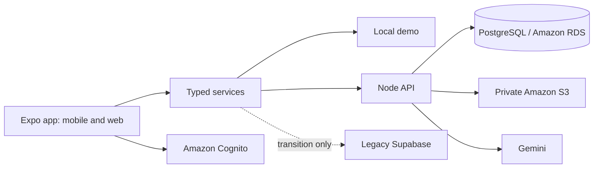

# ClassLens: from lecture capture to a dependable study companion

Status: implementation in progress. Approved direction: full-stack redesign with an AWS-deployable replacement for Supabase; local commits at each completed checkpoint. No cloud deployment or database migration is authorized.

## Product decision

Keep the existing audience: college students in a small pilot of 10–20 people. ClassLens should help a student answer three questions: What happened in class? What do I need to understand? What should I review next?

The main loop is **capture → verify the original → organize → retrieve from memory → review again**. Success means useful learning activity, not the number of AI summaries generated. The app must keep original photos accessible, label AI output, avoid invented deadlines or mastery scores, and let the student decide what is shared.

Measure in a pilot: successful capture-to-notebook completion, return to review within a week, recovery from failed uploads, and whether students can explain a concept after reviewing. No telemetry is collected in this change; these are pilot evaluation questions.

## Architecture decision

Use a modular monolith, not microservices. Expo screens call typed services; services select the mock, legacy Supabase, or HTTP API adapter. The API validates requests, verifies Cognito access tokens, and performs parameterized PostgreSQL operations under a transaction-local user identity. PostgreSQL RLS independently limits access. S3 stores immutable private photos; Gemini is called only by the server.

PostgreSQL fits the existing relational data: courses, enrollments, notes, friendships and review history. RDS is the AWS hosting target; the schema uses standard PostgreSQL without Supabase extensions. Cognito replaces Supabase Auth, and S3 replaces Supabase Storage. Keeping the old adapter until live parity is verified protects existing users and demo data.

Deploy later as one API container with a private RDS instance and S3 bucket in one region. Use an IAM task role and Secrets Manager, a distinct migration principal, TLS with certificate verification, and a non-owner runtime database role. Five pooled connections are sufficient for this pilot. A hardware capture device can later use the same authenticated material API after explicit user pairing; no hardware, ambient recording, device credentials, or new infrastructure is part of this implementation.

## Checkpoints and commits

| Step | Deliverable | Acceptance criteria | Tests before checkpoint |
| --- | --- | --- | --- |
| 0 | Local Git baseline | Original archive recorded on integration; no push | Inspect status and tracked files |
| 1 | Product plan and architecture | Scope, security boundary, migration path and test gates documented | Documentation review; diff check |
| 2 | PostgreSQL API | Courses, enrollments, profiles, notes, photos, AI, friendships and review API; additive schema; no Supabase runtime dependency | Authentication failures, malformed requests, authorization, ownership, retry behavior, error redaction, review scheduling; server typecheck |
| 3 | App API adapter | Existing service signatures work against the API; Cognito confirmation/sign-in/sign-out; legacy and mock modes remain | Adapter contracts, session transitions, root app typecheck |
| 4 | Study workspace and UI | Responsive accessible home, navigation, notebooks, explicit sharing, useful next-review queue with real persisted progress | Review scheduling edge cases, UI smoke tests where available, web build |
| 5 | Verification and handoff | Reproducible setup, deployment and cutover instructions, honest test report | Full relevant suite; npx tsc --noEmit; git diff --check; device checklist |

Each completed checkpoint gets a local commit. If required verification cannot run, record the exact blocker and do not describe the checkpoint as verified. Do not commit secrets, dependency directories, build output, or logs.

## Security and reliability acceptance criteria

- Missing, expired, wrong-pool, wrong-client, and wrong-token-type credentials are rejected. No development authentication bypass ships in the server.
- The request body cannot select its user identity. RLS context comes from a verified token and is local to one database transaction.
- Private notebooks remain private by default. Sharing requires an explicit author action, an accepted friendship, and the recipient's enrollment in the same course. Turning off sharing revokes future reads and new signed links; previously issued links expire within five minutes. Downloaded files and independent copies cannot be recalled.
- Profile discovery returns names and academic details, never email, password, or Cognito internals.
- Database migrations are additive and separate from application startup. They are reviewed and applied only after a separate request.
- Originals remain immutable. Upload and copy retries use stable identities; errors never turn into fake success. AI failures are visible and retryable.
- AI output is untrusted: validate its shape, constrain source context, and distinguish generated notes from original material. Never infer that a class was missed merely because there are no uploads.
- Validate input lengths and file sizes. Bound network calls and list sizes, rate-limit requests, and redact credentials from logs. Health endpoints reveal no credentials or internal connection details.
- Do not store native refresh tokens in plain localStorage. Web sessions remain in memory unless a separate secure cookie flow is implemented.

## Test strategy

Use unit tests for review intervals and parsers; API injection tests for real routing, validation, authentication gates and error behavior; PostgreSQL integration tests for RLS and transaction isolation. Tests must exercise observable behavior and failures, not merely reproduce implementation formulas.

Database integration tests require a separately approved disposable database and reviewed migrations. They must never default to a configured production DATABASE_URL. No remote database or cloud account is touched by the ordinary test command. Stub external AI/S3 dependencies in automated route tests; verify real providers during the deployment acceptance run.

Device acceptance: account creation and email verification; sign-in and relaunch; profile and enrollment; 1–6 photo capture; failed-upload retry; save and reopen originals; ask and quiz; mark review confidence and see the next-review date; two-account friend request and opt-in sharing; unauthorized third-account access; sign-out and expired session; dark mode, screen reader labels and enlarged text. Camera and background behavior require a physical iOS/Android device and cannot be established by a web build.

## Migration and rollback

This is a replacement backend implementation, not a completed production data migration. Provision the new stack separately. Export only after authorization, map old auth IDs to verified Cognito users, copy original objects with integrity checks, import rows under the migration principal, then reconcile row counts and object hashes. Passwords cannot be copied directly into Cognito; use verified account migration or password reset. Rehearse on a disposable environment and test two-account isolation before cutover.

Switch the client to API mode only after live acceptance. Keep the old database read-only during a controlled cutover window; do not allow concurrent writes to both backends. Rolling back after new writes requires reconciling those writes, not merely changing an environment variable. No tables, objects, or old migrations are deleted by this change.

## Explicitly deferred

Automatic attendance inference, automatic CatchUp notifications, continuous recording, hardware integration, institution admin portals, payment, analytics pipelines, Kubernetes, vector databases and distributed queues. The existing milestone plan remains historical context for those features; it does not make them part of this delivery.

## Reference documentation

- [Expo SDK 57](https://docs.expo.dev/versions/v57.0.0/)
- [Amazon RDS PostgreSQL](https://docs.aws.amazon.com/AmazonRDS/latest/UserGuide/CHAP_PostgreSQL.html)
- [Cognito token verification](https://docs.aws.amazon.com/cognito/latest/developerguide/amazon-cognito-user-pools-using-tokens-verifying-a-jwt.html)
- [PostgreSQL row security](https://www.postgresql.org/docs/current/ddl-rowsecurity.html)

## Initial environment findings

The supplied directory is an archive without Git metadata or installed node_modules. FRONTEND_RULES.md and BACKEND_RULES.md were referenced but were absent in the project and the searched Downloads directories. Their absence does not authorize inventing additional restrictions. The existing README overstates several future features; the final documentation must distinguish implemented behavior from plans.
